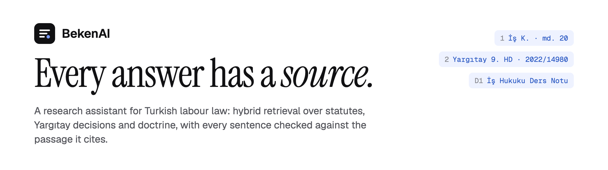
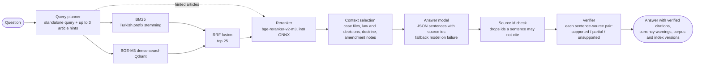
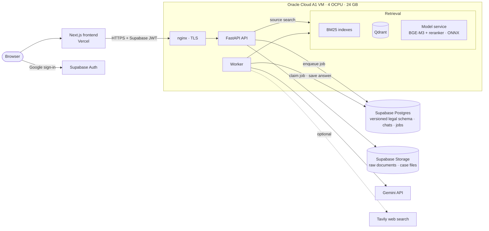

<p align="center">
  <picture>
    <source media="(prefers-color-scheme: dark)" srcset="docs/assets/readme/banner-dark.png">
    
  </picture>
</p>

<p align="center">
  <a href="https://bekenai.vercel.app"><b>Live demo</b></a>
  &nbsp;·&nbsp;
  <a href="#features">Features</a>
  &nbsp;·&nbsp;
  <a href="#how-an-answer-is-built">How it works</a>
  &nbsp;·&nbsp;
  <a href="#measured-results">Results</a>
  &nbsp;·&nbsp;
  <a href="#architecture">Architecture</a>
  &nbsp;·&nbsp;
  <a href="#engineering-decisions">Decisions</a>
</p>

<p align="center">
  <a href="https://github.com/alierenkonak/BekenAI/actions/workflows/ci.yml"></a>
  <a href="https://github.com/alierenkonak/BekenAI/actions/workflows/security-audit.yml"></a>
  <a href="https://bekenai.vercel.app"></a>
</p>

<p align="center">
  
  
  
  
  
  
  
  
  
  
  
  
</p>

<br>

<p align="center">
  <picture>
    <source media="(prefers-color-scheme: dark)" srcset="docs/assets/readme/demo-dark.gif">
    
  </picture>
  <br>
  <sub>The real interface replaying an answer the live pipeline wrote. The wait is shortened here; a real answer takes one to two minutes.</sub>
</p>

BekenAI answers questions on Turkish labour law from statutes, Yargıtay decisions and doctrine.
Every sentence of an answer carries the passages it relies on, and a second model checks each
sentence against those passages before the answer is shown. It can also read a user's own case
files, analyse a whole case, and run a multi-step research over the same sources.

> [!NOTE]
> BekenAI is a portfolio project. It runs on free tiers and is not legal advice. The interface
> and the answers are in Turkish; you can sign in with Google and try it with the fictional
> sample case file on the site.

## Features

<table>
  <tr>
    <td width="50%" valign="top">
      <h3>Cited, checked answers</h3>
      Each sentence lists its sources. A verifier labels every sentence–source pair as
      supported, partial or unsupported; unsupported citations are dropped, and a sentence
      left without support is marked as unverified. A citation opens the exact passage,
      with the article's official amendment history.
    </td>
    <td width="50%" valign="top">
      <h3>Case analysis</h3>
      Every ready file of a case is read, its legal issues are listed, and each issue is
      compared with the law, case law and doctrine. Critical deadlines are worked out in code
      from the dates in the file, and outdated provisions or decisions are flagged.
    </td>
  </tr>
  <tr>
    <td>
      <picture>
        <source media="(prefers-color-scheme: dark)" srcset="docs/assets/readme/chat-dark.png">
        
      </picture>
    </td>
    <td>
      <picture>
        <source media="(prefers-color-scheme: dark)" srcset="docs/assets/readme/analysis-dark.png">
        
      </picture>
    </td>
  </tr>
  <tr>
    <td width="50%" valign="top">
      <h3>Deep research</h3>
      A bounded multi-step search: up to 5 sub-questions, a gap analysis, and a lookup of the
      articles the found decisions rely on, ending in a structured report that goes through
      the same verification.
    </td>
    <td width="50%" valign="top">
      <h3>Private case files</h3>
      PDF, Word or TXT files are parsed and indexed in a workspace-scoped collection that never
      joins the shared corpus. Answers cite them by page, apart from the law.
    </td>
  </tr>
  <tr>
    <td>
      <picture>
        <source media="(prefers-color-scheme: dark)" srcset="docs/assets/readme/research-dark.png">
        
      </picture>
    </td>
    <td>
      <picture>
        <source media="(prefers-color-scheme: dark)" srcset="docs/assets/readme/case-dark.png">
        
      </picture>
    </td>
  </tr>
</table>

Also:

- **Provision currency checks.** Statute passages carry their official amendment notes. The
  code warns when a provision changed after the date of the events, and when the articles a
  cited Yargıtay decision relies on changed after the decision.
- **Source search.** Hybrid search over the corpus without starting a chat, with doctrine in
  its own list.
- **Web search, on request.** When the corpus has no source, or a provision has changed, the
  user can add a clearly labelled web section (Tavily). It never replaces the grounded answer.

## How an answer is built



1. **Planning.** Gemini 3.5 Flash Lite turns the message, with the conversation so far, into a
   standalone search query. It also names up to 3 statute articles that govern the question;
   those articles are fetched by number and join the candidates.
2. **Retrieval.** BM25 (words cut to their first five letters, which handles Turkish suffixes)
   and BGE-M3 vectors in Qdrant run side by side. Reciprocal Rank Fusion merges them, and a
   cross-encoder reranks the top 25. Doctrine is searched with the same query in its own
   channel.
3. **Context.** Passages are packed into a token budget. The user's files get their own share
   first, law and case law fill the target budget, and doctrine fills the rest up to a hard
   limit. The prompt tells the model to treat instructions inside sources and files as
   quotations, not commands.
4. **Writing.** Gemini 3.8 Flash writes structured JSON in which each sentence lists its source
   ids; if it fails (quota, overload, invalid or truncated output), Gemini 3.5 Flash Lite
   writes the answer instead. Source ids a sentence may not cite, such as an unknown id or a
   web page inside the grounded answer, are removed.
5. **Verification.** Gemini 3.5 Flash Lite checks every sentence–source pair on its own. The
   answer is stored with its citations and the corpus and index versions it used.

Questions run as jobs: the API answers `202 Accepted`, a worker claims the job from Postgres,
and the browser shows each stage live. Reranking runs on CPU and every cited sentence is
verified, so a chat answer takes one to two minutes.

## Corpus

| Source | Documents | Origin |
|---|---:|---|
| Laws (İş Kanunu, TBK, HMK, İş Mahkemeleri Kanunu, 5510 and others) | 25 | mevzuat.gov.tr |
| Regulations | 21 | mevzuat.gov.tr |
| Yargıtay decisions | 49 | karararama.yargitay.gov.tr |
| Doctrine: a labour-law course note, used with permission | 1 | |

Documents are split along their legal structure (article, paragraph, item), giving about 2,800
searchable passages of law and case law and 475 doctrine passages. Every passage keeps its
citation, article path and page. Each import is stored as a separate corpus version, so an old
answer can still be traced to the exact sources it used.

## Measured results

The evaluation set has 120 questions in 12 topics. 72 of them (6 per topic) name the statute
article that answers them. Each change to retrieval was measured on those 72 through the full
search path; the table shows how often the expected article appears in the results.

| Retrieval setup | Top 8 | Top 25 |
|---|---:|---:|
| Raw question, hybrid search and reranker | 81% | 86% |
| + query planner | 83% | 92% |
| + Turkish prefix stemming ([ADR 0010](docs/adr/0010-turkish-prefix-stemming.md)) | 85% | 94% |
| + planner article hints ([ADR 0011](docs/adr/0011-planner-article-hints.md)) | 86% | 97% |
| **Current system**, measured with the repo command, one eval label corrected | **89%** | **99%** |

Options that did not pay off are recorded as well: a wider rerank pool, windowed reranking of
long passages, and stemming for doctrine.

The reranker runs as an int8 ONNX export ([ADR 0005](docs/adr/0005-int8-onnx-reranker.md)). On
40 questions it cut reranking 25 candidates from 50.6 s to 14.4 s on 4 cores compared with
PyTorch, and found the expected article just as often.

To reproduce the retrieval numbers on a deployment (runbook:
[`docs/runbooks/oracle-api-runtime.md`](docs/runbooks/oracle-api-runtime.md)):

```bash
python -m app.chat.retrieval_eval --queries evals/labour_law/queries.v1.jsonl --out report/
```

## Architecture



- **Modular monolith** ([ADR 0001](docs/adr/0001-modular-monolith.md)): one deployable backend,
  with retrieval and ingestion as separate Python packages.
- **Private data stays private** ([ADR 0002](docs/adr/0002-global-private-data-boundary.md)):
  uploaded files live in their own storage bucket and vector collection, scoped to the user's
  workspace, and never enter the shared corpus.
- **Model service:** embeddings and reranking run in one loopback-only service. Qdrant is
  loopback-only as well.
- **Provider boundary** ([ADR 0003](docs/adr/0003-model-provider-abstraction.md)): model calls
  go through one interface, so the retrieval and citation core does not depend on Gemini.

<details>
<summary><b>Repository layout</b></summary>
<br>

| Path | Contents |
|---|---|
| `frontend/` | Next.js 16, React 19, Tailwind 4 |
| `backend/` | FastAPI API and worker; `app/chat` holds the answer, case analysis and deep research pipelines |
| `retrieval/` | `beken_retrieval`: BM25, Qdrant, fusion, reranking, the model service, evaluation |
| `ingestion/` | `beken_ingestion`: manifest-based import and structure-aware chunking of Turkish legal texts |
| `supabase/migrations/` | Database schema, including the versioned `legal` schema |
| `deploy/oracle/` | systemd units and hash-locked server requirements |
| `evals/` | The labour-law evaluation set (120 questions) |
| `docs/` | Architecture decision records, runbooks and the README images |

</details>

## Engineering decisions

Each decision is recorded with its context, the measurements behind it and its consequences.
The ADRs in [`docs/adr`](docs/adr) are written in Turkish.

| ADR | Decision |
|---|---|
| [0001](docs/adr/0001-modular-monolith.md) | Modular monolith |
| [0002](docs/adr/0002-global-private-data-boundary.md) | A hard boundary between the shared corpus and private files |
| [0003](docs/adr/0003-model-provider-abstraction.md) | Model-provider independence |
| [0004](docs/adr/0004-web-search-fallback.md) | Optional, labelled web search when the corpus has no source |
| [0005](docs/adr/0005-int8-onnx-reranker.md) | Run the reranker as int8 ONNX |
| [0006](docs/adr/0006-provision-effective-date-check.md) | Provision currency checks from official amendment notes |
| [0007](docs/adr/0007-deep-research.md) | Deep research over our own sources |
| [0008](docs/adr/0008-doctrine-always-on.md) | Search doctrine for every question |
| [0009](docs/adr/0009-case-deadlines-in-code.md) | Compute case deadlines in code, not in the model |
| [0010](docs/adr/0010-turkish-prefix-stemming.md) | Turkish prefix stemming for BM25 |
| [0011](docs/adr/0011-planner-article-hints.md) | Let the query planner name the governing articles |

## Running locally

Requirements: Node.js 22, Python 3.12 or 3.13, Docker.

```bash
cp .env.example .env
make setup       # frontend packages and a virtual environment from hash-locked requirements
make infra-up    # Postgres 17 and Qdrant
```

Then run `make backend-dev`, `make worker-dev` and `make frontend-dev` in separate terminals.

Answering questions also needs a Supabase project (auth, database, storage), a Gemini API key,
the model service, and the corpus and indexes, which are not in the repository. They are built
with `python -m beken_ingestion` and `python -m beken_retrieval` (`build-bm25`, `build-dense`);
see the runbooks in [`docs/runbooks`](docs/runbooks).

```bash
make lint      # ESLint and ruff
make test      # Python tests
make db-test   # database integration tests against local Postgres
make build     # frontend production build
```

## Deployment and CI

- **Frontend:** Vercel deploys `main` automatically.
- **Backend:** the API, worker, model service and Qdrant run as systemd services on an Oracle
  Cloud Always Free VM. Each release is an immutable directory behind a `current` symlink,
  which makes a rollback one switch. Server dependencies install only from hash-locked files.
- **CI:** every pull request runs ESLint, ruff, the frontend build, over 450 Python tests,
  database and Qdrant integration tests, and npm and pip audits.
- **Weekly security audit:** repeats the audits every Monday and also checks the pinned Qdrant
  image against Qdrant's own advisories.

## Limits

- Only labour law is covered.
- It is sized for a single-user demo on free tiers: an answer takes one to two minutes, a case
  analysis three to five.
- Scanned PDFs without a text layer cannot be read.
- Answers are for research. They are not legal advice.

<br>

<p align="center">
  <sub>Built by <a href="https://github.com/alierenkonak">Ali Eren Konak</a> · <a href="https://www.linkedin.com/in/alierenkonak/">LinkedIn</a></sub>
</p>
