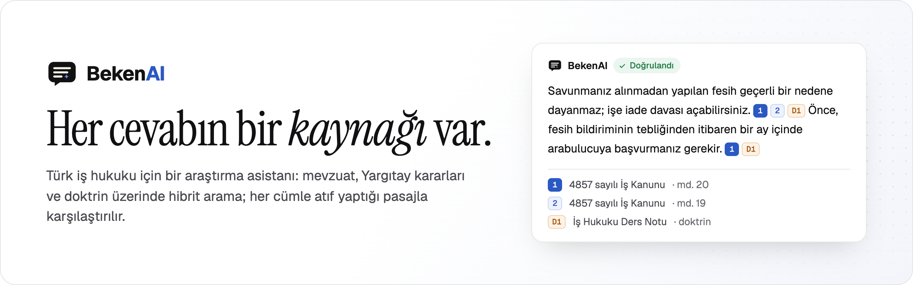
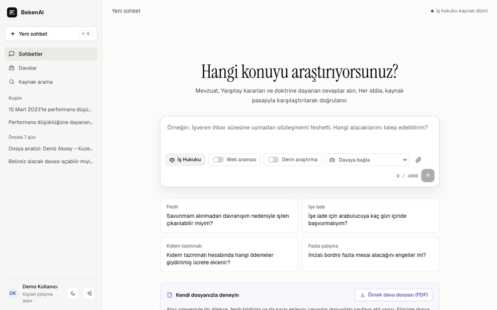
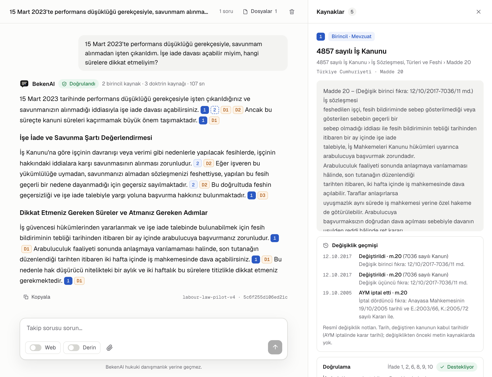
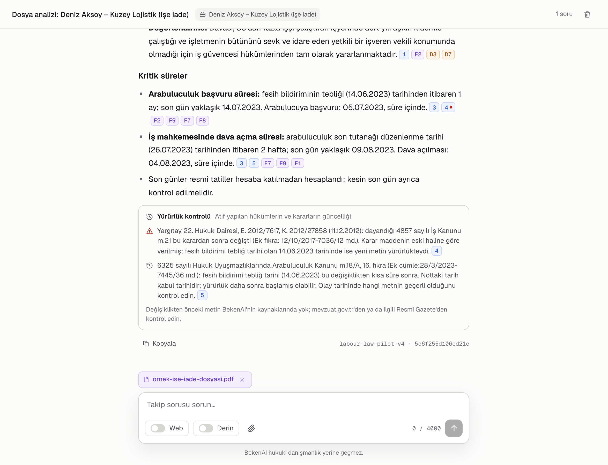
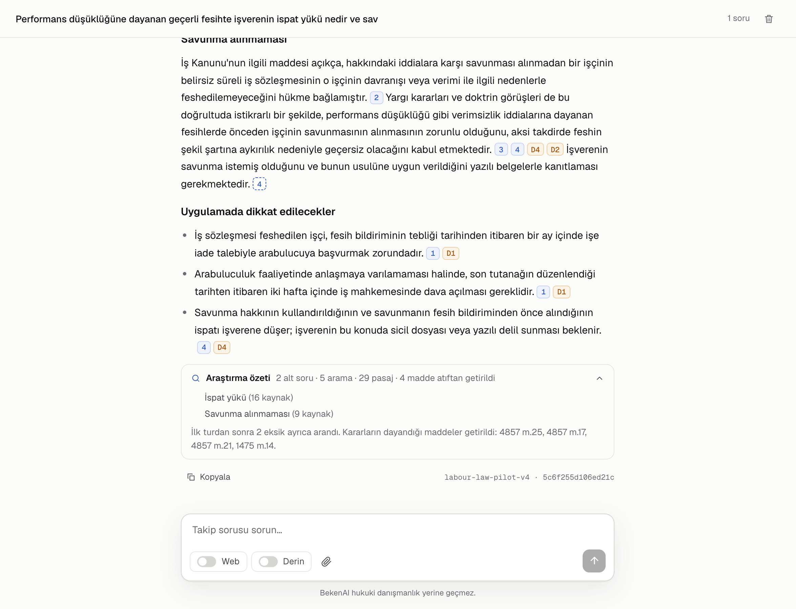
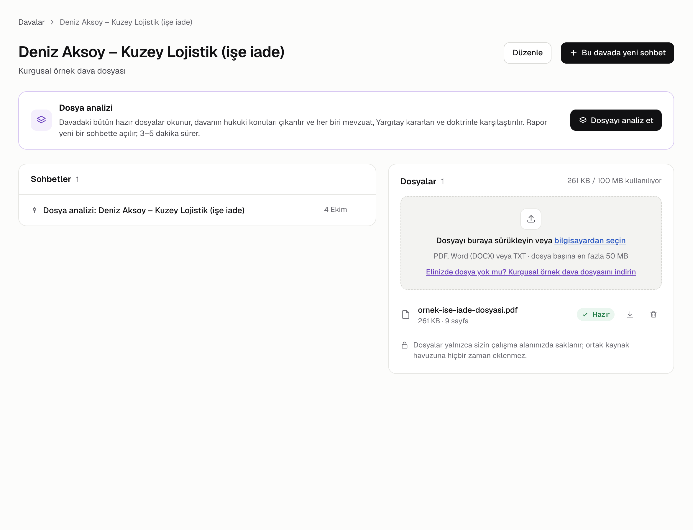
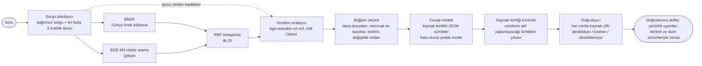
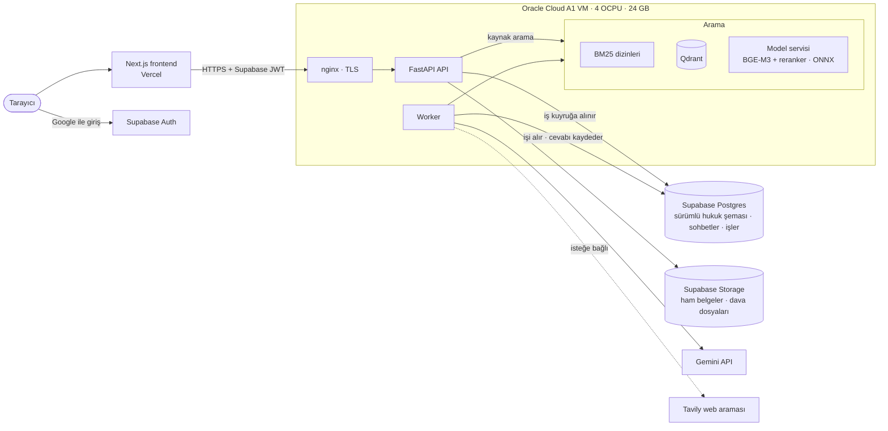

<p align="center">
  <picture>
    <source media="(prefers-color-scheme: dark)" srcset="docs/assets/readme/banner-tr-dark.png">
    
  </picture>
</p>

<p align="center">
  <a href="README.md">English</a> · <b>Türkçe</b>
</p>

<p align="center">
  <a href="https://bekenai.vercel.app"><b>Canlı demo</b></a>
  &nbsp;·&nbsp;
  <a href="#özellikler">Özellikler</a>
  &nbsp;·&nbsp;
  <a href="#bir-cevap-nasıl-oluşur">Nasıl çalışır</a>
  &nbsp;·&nbsp;
  <a href="#ölçülen-sonuçlar">Sonuçlar</a>
  &nbsp;·&nbsp;
  <a href="#mimari">Mimari</a>
  &nbsp;·&nbsp;
  <a href="#mühendislik-kararları">Kararlar</a>
</p>

<p align="center">
  <a href="https://github.com/alierenkonak/BekenAI/actions/workflows/ci.yml"></a>
  <a href="https://github.com/alierenkonak/BekenAI/actions/workflows/security-audit.yml"></a>
  <a href="https://bekenai.vercel.app"></a>
</p>

<p align="center">
  
  
  
  
  
  
  
  
  
  
  
  
</p>

<br>

<p align="center">
  <picture>
    <source media="(prefers-color-scheme: dark)" srcset="docs/assets/readme/demo-dark.gif">
    
  </picture>
  <br>
  <sub>Gerçek arayüz, canlı hattın yazdığı bir cevabı yeniden oynatıyor. Bekleme burada kısaltıldı; gerçek bir cevap bir iki dakika sürer.</sub>
</p>

BekenAI, Türk iş hukukuyla ilgili soruları mevzuat, Yargıtay kararları ve doktrinden cevaplar.
Cevaptaki her cümle dayandığı pasajları gösterir; cevap kullanıcıya ulaşmadan önce ikinci bir
model her cümleyi bu pasajlarla karşılaştırır. BekenAI ayrıca kullanıcının kendi dava
dosyalarını okuyabilir, bir davanın bütününü analiz edebilir ve aynı kaynaklar üzerinde çok
adımlı bir araştırma yürütebilir.

> [!NOTE]
> BekenAI bir portfolyo projesidir. Ücretsiz katmanlarda çalışır ve hukuki danışmanlık yerine
> geçmez. Arayüz Türkçe ya da İngilizce kullanılabilir; sorular, kaynaklar ve cevaplar Türkçedir.
> Google ile giriş yapıp sitedeki kurgusal örnek dava dosyasıyla deneyebilirsiniz.

## Özellikler

<table>
  <tr>
    <td width="50%" valign="top">
      <h3>Atıflı ve doğrulanmış cevaplar</h3>
      Her cümle kaynaklarını listeler. Doğrulayıcı her cümle–kaynak çiftini destekliyor,
      kısmen destekliyor veya desteklemiyor diye etiketler; desteklenmeyen atıflar çıkarılır,
      dayanağı kalmayan cümle "doğrulanamadı" diye işaretlenir. Bir atıf, tam ilgili pasajı
      maddenin resmî değişiklik geçmişiyle birlikte açar.
    </td>
    <td width="50%" valign="top">
      <h3>Dava analizi</h3>
      Davanın hazır olan bütün dosyaları okunur, hukuki meseleler listelenir ve her mesele
      mevzuat, içtihat ve doktrinle karşılaştırılır. Kritik süreler dosyadaki tarihlerden kodla
      hesaplanır; yürürlüğü değişmiş hükümler ve kararlar işaretlenir.
    </td>
  </tr>
  <tr>
    <td>
      <picture>
        <source media="(prefers-color-scheme: dark)" srcset="docs/assets/readme/chat-dark.png">
        
      </picture>
    </td>
    <td>
      <picture>
        <source media="(prefers-color-scheme: dark)" srcset="docs/assets/readme/analysis-dark.png">
        
      </picture>
    </td>
  </tr>
  <tr>
    <td width="50%" valign="top">
      <h3>Derin araştırma</h3>
      Sınırlı, çok adımlı bir arama: en fazla 5 alt soru, bir eksik analizi ve bulunan
      kararların dayandığı maddelerin ayrıca getirilmesi. Sonuç, aynı doğrulamadan geçen
      yapılandırılmış bir rapordur.
    </td>
    <td width="50%" valign="top">
      <h3>Özel dava dosyaları</h3>
      PDF, Word veya TXT dosyaları ayrıştırılır ve çalışma alanına özel, ortak derleme hiç
      karışmayan bir koleksiyonda dizinlenir. Cevaplar bu dosyalara mevzuattan ayrı olarak
      sayfa numarasıyla atıf yapar; dava sayfası dosyaların hesabın depolama alanından ne kadar
      kullandığını gösterir.
    </td>
  </tr>
  <tr>
    <td>
      <picture>
        <source media="(prefers-color-scheme: dark)" srcset="docs/assets/readme/research-dark.png">
        
      </picture>
    </td>
    <td>
      <picture>
        <source media="(prefers-color-scheme: dark)" srcset="docs/assets/readme/case-dark.png">
        
      </picture>
    </td>
  </tr>
</table>

Ayrıca:

- **Yürürlük kontrolleri.** Mevzuat pasajları resmî değişiklik notlarını taşır. Kod, bir hüküm
  olay tarihinden sonra değiştiyse ve atıf yapılan bir Yargıtay kararının dayandığı maddeler
  karardan sonra değiştiyse uyarı verir.
- **Kaynak arama.** Sohbet başlatmadan derlem üzerinde hibrit arama; doktrin ayrı bir listede
  gösterilir.
- **İsteğe bağlı web araması.** Derlemde kaynak yoksa ya da bir hüküm değişmişse kullanıcı
  açıkça etiketlenmiş bir web bölümü ekleyebilir (Tavily). Bu bölüm kaynaklı cevabın yerine
  geçmez.
- **Göze batmayan bir çalışma alanı.** Sohbetler kenar çubuğundan sabitlenebilir, yeniden
  adlandırılabilir ve silinebilir. Kenar çubuğu ve kaynak paneli sürüklenerek
  boyutlandırılabilir ya da tamamen kapatılabilir; cevap sütunu okunabilir genişliğini korur.
  Kaynak paneli atıf işaretlerini açıklar (destekliyor, kısmen destekliyor, hüküm sonradan
  değişmiş). Açık ve koyu tema, Türkçe ve İngilizce arayüz vardır.

## Bir cevap nasıl oluşur



1. **Planlama.** Gemini 3.5 Flash Lite, mesajı o ana kadarki konuşmayla birlikte bağımsız bir
   arama sorgusuna çevirir. Soruyu düzenleyen en fazla 3 kanun maddesini de adlandırır; bu
   maddeler numarasıyla getirilip adaylara eklenir.
2. **Arama.** BM25 (Türkçe ekleri karşılamak için kelimelerin ilk beş harfi) ve Qdrant'taki
   BGE-M3 vektörleri yan yana çalışır. Reciprocal Rank Fusion ikisini birleştirir, bir
   cross-encoder ilk 25'i yeniden sıralar. Doktrin aynı sorguyla kendi kanalında aranır.
3. **Bağlam.** Pasajlar bir token bütçesine yerleştirilir. Önce kullanıcının dosyaları kendi
   payını alır, mevzuat ve içtihat hedef bütçeyi doldurur, doktrin kalan yeri kesin sınıra kadar
   kullanır. İstem, kaynakların ve dosyaların içindeki talimatların komut değil alıntı olarak
   ele alınmasını söyler.
4. **Yazma.** Gemini 3.8 Flash, her cümlenin kaynak kimliklerini listelediği yapılandırılmış
   JSON yazar; başarısız olursa (kota, aşırı yük, geçersiz veya yarım çıktı) cevabı Gemini 3.5
   Flash Lite yazar. Bir cümlenin atıf yapamayacağı kimlikler, örneğin bilinmeyen bir kimlik ya
   da kaynaklı cevabın içindeki bir web sayfası, çıkarılır.
5. **Doğrulama.** Gemini 3.5 Flash Lite her cümle–kaynak çiftini ayrı ayrı kontrol eder. Cevap,
   atıflarıyla ve kullandığı derlem ve dizin sürümleriyle birlikte saklanır.

Sorular iş olarak çalışır: API `202 Accepted` döner, bir worker işi Postgres'ten alır ve
tarayıcı her aşamayı canlı gösterir. Yeniden sıralama CPU'da çalıştığı ve atıflı her cümle
doğrulandığı için bir sohbet cevabı bir iki dakika sürer.

## Kaynak derlemi

| Kaynak | Belge | Köken |
|---|---:|---|
| Kanunlar (İş Kanunu, TBK, HMK, İş Mahkemeleri Kanunu, 5510 ve diğerleri) | 25 | mevzuat.gov.tr |
| Yönetmelikler | 21 | mevzuat.gov.tr |
| Yargıtay kararları | 49 | karararama.yargitay.gov.tr |
| Doktrin: izinle kullanılan bir iş hukuku ders notu | 1 | |

Belgeler hukuki yapılarına göre (madde, fıkra, bent) bölünür; bu, mevzuat ve içtihatta yaklaşık
2.800, doktrinde 475 aranabilir pasaj demektir. Her pasaj künyesini, madde yolunu ve sayfasını
taşır. Her içe aktarma ayrı bir derlem sürümü olarak saklanır; böylece eski bir cevap
kullandığı kaynaklara tam olarak geri izlenebilir.

## Ölçülen sonuçlar

Değerlendirme setinde 12 konuda 120 soru var. Bunların 72'si (konu başına 6) cevabı veren kanun
maddesini belirtir. Aramadaki her değişiklik bu 72 soru üzerinde tam arama yoluyla ölçüldü;
tablo beklenen maddenin sonuçlarda ne sıklıkla çıktığını gösterir.

| Arama düzeni | İlk 8 | İlk 25 |
|---|---:|---:|
| Ham soru, hibrit arama ve yeniden sıralayıcı | %81 | %86 |
| + sorgu planlayıcı | %83 | %92 |
| + Türkçe önek kökleme ([ADR 0010](docs/adr/0010-turkish-prefix-stemming.md)) | %85 | %94 |
| + planlayıcının madde ipuçları ([ADR 0011](docs/adr/0011-planner-article-hints.md)) | %86 | %97 |
| **Şu anki sistem**, repodaki komutla ölçüldü, bir değerlendirme etiketi düzeltildi | **%89** | **%99** |

İşe yaramayan seçenekler de kayıt altında: daha geniş bir yeniden sıralama havuzu, uzun
pasajların pencereli yeniden sıralanması ve doktrin için kökleme.

Yeniden sıralayıcı int8 ONNX olarak çalışır ([ADR 0005](docs/adr/0005-int8-onnx-reranker.md)).
40 soruda, 25 adayın yeniden sıralanmasını 4 çekirdekte PyTorch'a göre 50,6 saniyeden 14,4
saniyeye indirdi ve beklenen maddeyi aynı sıklıkla buldu.

Arama sonuçlarını bir kurulumda yeniden üretmek için (runbook:
[`docs/runbooks/oracle-api-runtime.md`](docs/runbooks/oracle-api-runtime.md)):

```bash
python -m app.chat.retrieval_eval --queries evals/labour_law/queries.v1.jsonl --out report/
```

## Mimari



- **Modüler monolit** ([ADR 0001](docs/adr/0001-modular-monolith.md)): tek bir yayınlanabilir
  backend; arama ve içe aktarma ayrı Python paketleridir.
- **Özel veri özel kalır** ([ADR 0002](docs/adr/0002-global-private-data-boundary.md)):
  yüklenen dosyalar kendi depolama alanında ve kendi vektör koleksiyonunda, kullanıcının çalışma
  alanıyla sınırlı olarak durur ve ortak derleme hiç girmez.
- **Model servisi:** embedding ve yeniden sıralama yalnızca loopback'ten erişilen tek bir
  serviste çalışır. Qdrant da yalnızca loopback'ten erişilebilir.
- **Sağlayıcı sınırı** ([ADR 0003](docs/adr/0003-model-provider-abstraction.md)): model
  çağrıları tek bir arayüzden geçer; arama ve atıf çekirdeği Gemini'ye bağlı değildir.

<details>
<summary><b>Repo yapısı</b></summary>
<br>

| Yol | İçerik |
|---|---|
| `frontend/` | Next.js 16, React 19, Tailwind 4 |
| `backend/` | FastAPI API ve worker; `app/chat` cevap, dava analizi ve derin araştırma hatlarını içerir |
| `retrieval/` | `beken_retrieval`: BM25, Qdrant, birleştirme, yeniden sıralama, model servisi, değerlendirme |
| `ingestion/` | `beken_ingestion`: manifest tabanlı içe aktarma ve Türkçe hukuk metinlerinin yapıya duyarlı bölünmesi |
| `supabase/migrations/` | Veritabanı şeması, sürümlü `legal` şeması dahil |
| `deploy/oracle/` | systemd birimleri ve hash'e kilitli sunucu bağımlılıkları |
| `evals/` | İş hukuku değerlendirme seti (120 soru) |
| `docs/` | Mimari karar kayıtları, runbook'lar ve README görselleri |

</details>

## Mühendislik kararları

Her karar bağlamı, dayandığı ölçümler ve sonuçlarıyla birlikte
[`docs/adr`](docs/adr) klasöründe kayıtlıdır.

| ADR | Karar |
|---|---|
| [0001](docs/adr/0001-modular-monolith.md) | Modüler monolit |
| [0002](docs/adr/0002-global-private-data-boundary.md) | Ortak derlem ile özel dosyalar arasında kesin sınır |
| [0003](docs/adr/0003-model-provider-abstraction.md) | Model sağlayıcısından bağımsızlık |
| [0004](docs/adr/0004-web-search-fallback.md) | Derlemde kaynak yoksa isteğe bağlı, etiketli web araması |
| [0005](docs/adr/0005-int8-onnx-reranker.md) | Yeniden sıralayıcıyı int8 ONNX olarak çalıştırmak |
| [0006](docs/adr/0006-provision-effective-date-check.md) | Resmî değişiklik notlarından yürürlük kontrolü |
| [0007](docs/adr/0007-deep-research.md) | Kendi kaynaklarımız üzerinde derin araştırma |
| [0008](docs/adr/0008-doctrine-always-on.md) | Her soruda doktrini de aramak |
| [0009](docs/adr/0009-case-deadlines-in-code.md) | Dava sürelerini modelde değil kodda hesaplamak |
| [0010](docs/adr/0010-turkish-prefix-stemming.md) | BM25 için Türkçe önek kökleme |
| [0011](docs/adr/0011-planner-article-hints.md) | Sorgu planlayıcının ilgili maddeleri adlandırması |

## Yerelde çalıştırma

Gereksinimler: Node.js 22, Python 3.12 veya 3.13, Docker.

```bash
cp .env.example .env
make setup       # frontend paketleri ve hash'e kilitli bağımlılıklardan bir sanal ortam
make infra-up    # Postgres 17 ve Qdrant
```

Ardından ayrı terminallerde `make backend-dev`, `make worker-dev` ve `make frontend-dev`
çalıştırın.

Soru cevaplamak için ayrıca bir Supabase projesi (kimlik doğrulama, veritabanı, depolama), bir
Gemini API anahtarı, model servisi ve repoda bulunmayan derlem ile dizinler gerekir. Bunlar
`python -m beken_ingestion` ve `python -m beken_retrieval` (`build-bm25`, `build-dense`) ile
oluşturulur; ayrıntılar [`docs/runbooks`](docs/runbooks) klasöründeki runbook'larda.

```bash
make lint      # ESLint ve ruff
make test      # Python testleri
make db-test   # yerel Postgres'e karşı veritabanı entegrasyon testleri
make build     # frontend production build
```

## Yayına alma ve CI

- **Frontend:** Vercel `main` dalını otomatik yayınlar.
- **Backend:** API, worker, model servisi ve Qdrant, Oracle Cloud Always Free VM üzerinde
  systemd servisleri olarak çalışır. Her sürüm `current` sembolik bağlantısının arkasında
  değişmez bir klasördür; geri dönüş tek bir geçişle yapılır. Sunucu bağımlılıkları yalnızca
  hash'e kilitli dosyalardan kurulur.
- **CI:** her pull request'te ESLint, ruff, frontend build, 450'den fazla Python testi,
  veritabanı ve Qdrant entegrasyon testleri ile npm ve pip denetimleri çalışır.
- **Haftalık güvenlik denetimi:** denetimleri her pazartesi tekrarlar ve sabitlenmiş Qdrant
  imajını Qdrant'ın kendi güvenlik duyurularına karşı da kontrol eder.

## Sınırlar

- Yalnızca iş hukuku kapsanır.
- Ücretsiz katmanlarda tek kullanıcılı bir demo için boyutlandırılmıştır: bir cevap bir iki
  dakika, bir dava analizi üç beş dakika sürer.
- Metin katmanı olmayan taranmış PDF'ler okunamaz.
- Cevaplar araştırma içindir, hukuki danışmanlık değildir.

<br>

<p align="center">
  <sub><a href="https://github.com/alierenkonak">Ali Eren Konak</a> tarafından geliştirildi · <a href="https://www.linkedin.com/in/alierenkonak/">LinkedIn</a></sub>
</p>
